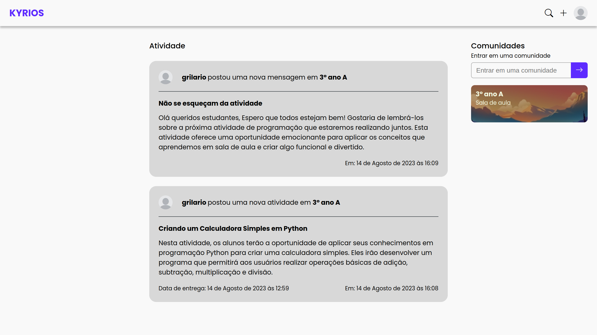
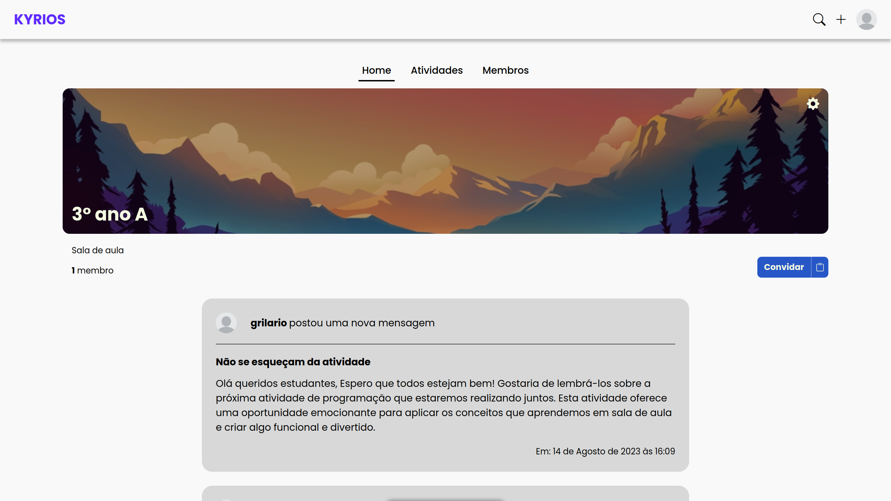
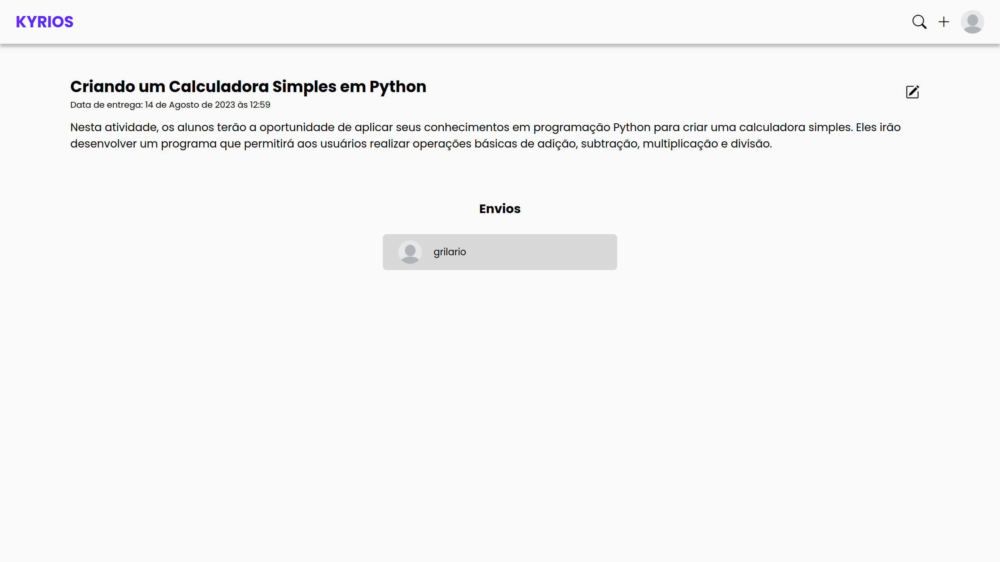
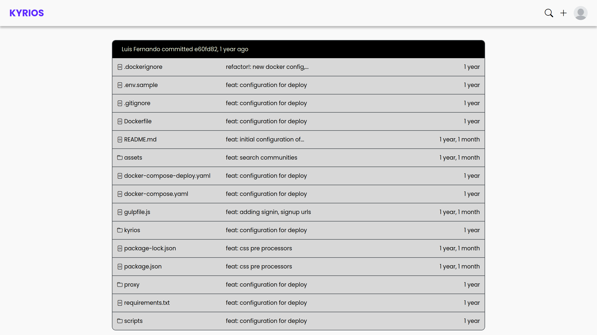

# Kyrios

Kyrios é uma solução completa para a entrega e gerenciamento de atividades educacionais, inspirada no Google Classroom. Combina recursos de gerenciamento de atividades com a tecnologia de versionamento de código GIT, o Kyrios oferece uma experiência eficaz e envolvente para alunos e educadores nas areas de programação.

### Recursos

- Criação de avisos e atividades para classe.
- Entrega de atividades através de repositórios **GIT**.
- **Navegação** e visualização interna do repositórios.
- **Múltiplos administrados** para classe.
- Personalização dos banners das classes.
- **Tema claro e escuro**.

### Images

<p align="center">
    
</p>

<p align="center">
    
</p>

<p align="center">
    
</p>

<p align="center">
    
</p>

<p align="center">
    
</p>

### Executando

Para executar é necessário ter o docker com docker compose.

1. Clone o repositório e vá para o diretório:

   ```sh
   git clone https://github.com/grilario/kyrios-git.git
   cd kyrios-git
   ```

2. Execute os seguintes comandos:

   ```sh
   docker compose up -d
   docker exec <container> sh -c 'python manage.py migrate'
   ```

   _Troque \<container> pelo ID do container Web_
